<p align="center">
  
</p>

# Harvest

Post-harvest loss prevention and offtaker matching for Nigerian smallholder
farmers.

Harvest logs a harvest in thirty seconds by picture and voice, warns before
the crop turns, prices selling today against waiting and against a cold room
in naira, and — once a farmer wants one — finds a verified buyer. Everything
about the farmer's own crop runs on the phone, with no signal, for days.

<p align="center">
  
  
  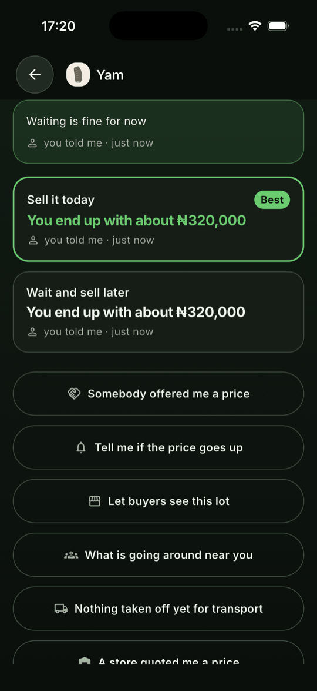
</p>

> **The pictures are drawn; the voices are not.** All 89 crop, unit, storage,
> outcome, loss and ailment tiles are illustrations — flat shapes, silhouettes
> chosen so the three greens and the three peppers are told apart by shape and
> not only by colour. What R4 still wants is the judgement of somebody who has
> seen the crops in an actual market. The audio has not moved: all 1182 clips say,
> in English, that they are placeholders and which language belongs there,
> because a stand-in that sounded like the product is how a missing feature
> ships.

---

## 1. The problem

Nigeria loses a very large share of everything it grows — commonly estimated
between 30% and 50% for perishables — in the days *after* harvest. Not to
drought or pests, but to a farmer who cannot see the market, cannot see the
spoilage clock, cannot find the cold room twenty kilometres away, and
therefore sells at a bad price on day five in ignorance.

> **The spoilage clock is the wedge, not the marketplace.**

Marketplaces need liquidity on both sides before either side gets value, which
is why so many agritech marketplaces died with empty listings. A spoilage
countdown is useful to a farmer with one crop and no buyer anywhere near the
app — day one, one user, zero network effect. And it generates exactly the
data the marketplace needs: what was harvested, where, how much, and when it
must move. Liquidity accumulates as a by-product of a feature that was already
worth using alone.

### What it is not

**It never states a dose and never names a product.** *"Mix 20 ml in 15
litres"* is the sentence a farmer wants and the one this app has no business
producing: it cannot read the label on what the local dealer stocks, does not
know the sprayer's volume or the pre-harvest interval, and the spraying is
done by a person usually without protective equipment, on food that will be in
a market that week. Two tests scan every guidance step for a quantity and for
a product name.
[ADR-0008](docs/adr/0008-the-app-never-states-a-dose.md).

**It does not handle the money.** A deal is written down and confirmed by
both sides; what changes hands is between them, and the screen says so.

**It does not guess.** Where there is no price the app says *"I do not know
what this is worth"* and asks. Where the classifier is unsure it routes to a
person above the steps. Where the weather is missing the window widens rather
than fills in. And the diagnosis feature is not reachable from the app at all,
because there is no trained model — a screen a farmer can open and get a guess
from is worse than one they cannot open.

---

## 2. How it works

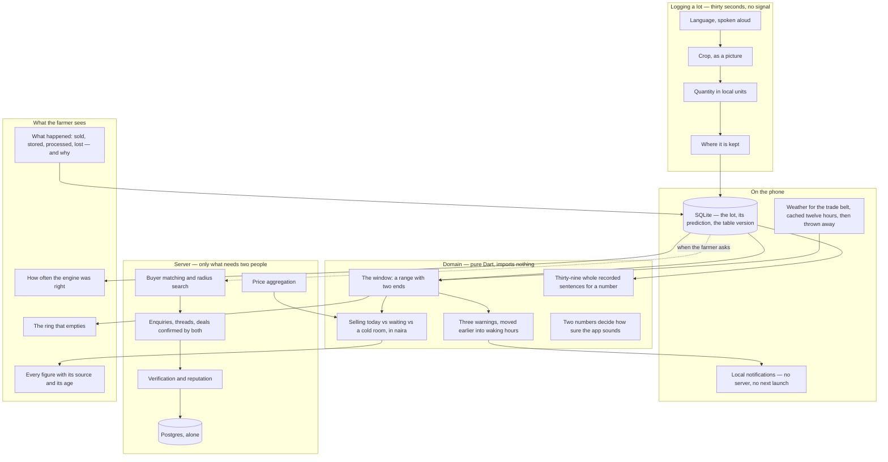

### The window has two ends, and says so

The engine returns a range, never an hour. The base value is itself a range —
a tomato out of the ground lasts two to four days depending on variety,
bruising and how ripe it was picked, and the app knows none of those three —
and every factor multiplies both ends. Temperature is the biggest lever by
far: the Q10 rule, respiration roughly doubling every 10 °C, which is why a
cold room is worth paying for. **A missing weather reading widens the window
rather than filling it in**: the pessimistic end assumes a hot afternoon and
the optimistic end a cool night, and the sentence the app says gets visibly
less useful, which is the honest consequence of not knowing.

### Waiting is a choice with a price, and nobody quotes it

A farmer weighing ₦400 a kilo today against ₦450 on Friday is comparing two
prices, and on those numbers waiting is obviously right. The tonnage that will
not survive until Friday never enters the comparison, because there is no
market for the part of your harvest that rots. So waiting is valued on **what
will still exist**, from the window's own range — no second spoilage model to
drift from the first. A lorry has to be paid, an agent takes a share, some of
the load arrives bruised, and those come off every course alike; commission is
charged on what *arrives*, because charging it on the gross overstates what
the agent takes and understates what the road does, and one is negotiable and
the other is a road.

**Every figure names its source and its age**, and that is a type rather
than a habit — `Sourced<T>`, with `map` the only way to derive one figure from
another, so a naira estimate computed from a nine-day-old price is nine days
old and the arithmetic cannot quietly lose that.

### The engine has to be able to be wrong

Phase 6's gate is that *a prediction the engine made is compared against
what actually happened to that lot, and the comparison published — including
where the engine was wrong.* So the first half is written down at the moment
it is made — the window, its confidence, and the version of the table that
produced it, on the lot — because it cannot be reconstructed afterwards: the
table is versioned and will be revised, and recomputing a three-month-old
window would compare today's model against yesterday's outcome and call the
difference an improvement. A lot is closed by saying what happened to it, and
a loss asks **why** from a fixed illustrated list with no "other" — a sixth
answer meaning *none of these* would absorb every case the list is missing
and hide exactly the pattern worth finding.

### The speech is bundled, not synthesised

System speech for Hausa, Yoruba, Igbo and Nigerian Pidgin is inconsistent on
Android and largely absent on iOS. Checked rather than assumed: `say -v '?'`
on the build machine offers **forty-three English voices and not one** for any
of them. So every fixed prompt is a bundled recording, and `make audio-check`
fails the build when one is missing in any language — reading every list it
checks out of the Dart enums, out of *one* table of them, because three copies
is how it once reported a complete set while a hundred and fifty-five clips
were outside its knowledge.
[ADR-0001](docs/adr/0001-speech-is-bundled-not-synthesised.md).

---

## 3. The app

Twenty-two screens, illustration-led and voice-first, with no standard
platform control anywhere; dark by default and light one tap away, because a
phone in direct sunlight is a working condition and not a preference.

### Logging a lot

<p align="center">
  
  
  
</p>

Six languages, each named in its own and spoken aloud as it is focused. The
crop grid is twenty-five pictures ordered by how fast each spoils. Quantity is
a pad and nine measures as pictures — a basket weighs differently in each
region, so the app asks where you farm, once, and never asks for a location —
with the kilogram equivalent always on screen and the farmer's own correction
kept for ever, marked *corrected*, never overruled by a later table.

### Saying a number without stitching words together

The obvious way to say *"about forty-five kilograms"* is a clip per number
word and a template per sentence. It does not survive contact with these
languages: Yoruba counts subtractively — forty-five is *marùndínláàádọ́ta*,
**five taken from fifty** — and a sentence assembled from words recorded in
isolation has the wrong intonation on every one of them. So the app says fewer
numbers and says them properly: a closed scale of thirty-nine **whole recorded
sentences**, chosen by nearest ratio. The screen shows 48 kg and the app says
*"about fifty"*, which is the honest way round given the weight is usually
inferred from a table of regional averages.

### Two screens, one working condition

<p align="center">
  
  
  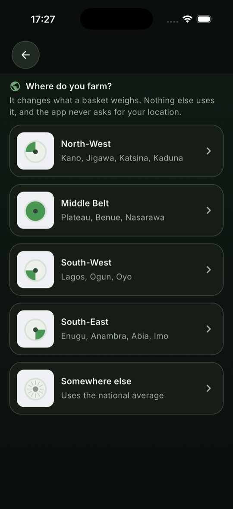
</p>

Both themes are authored, neither derived from the other, and every colour
pair in both is asserted in CI at 4.5:1 for text and 3:1 for the colours that
carry state. That test found a real defect on its first run: the light-theme
amber meaning *half the window is gone* was 2.69:1 against white. The ring on
each lot empties as the window runs, and the app says out loud whether a lot
is still fine, half gone, nearly finished or out of time.

### The decision

<p align="center">
  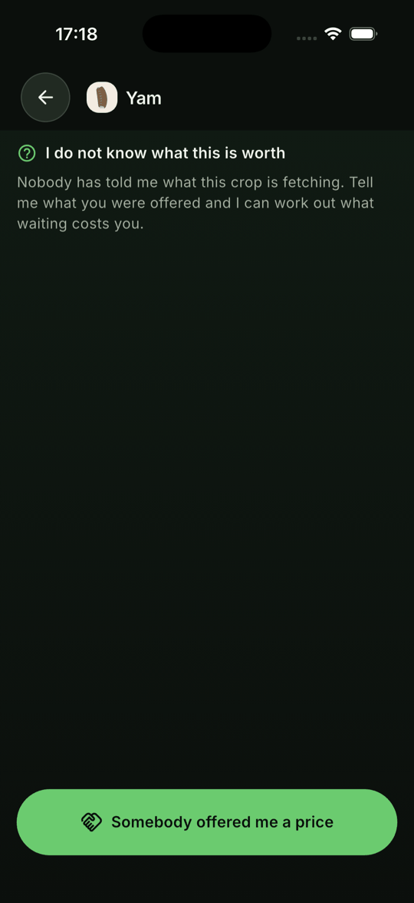
  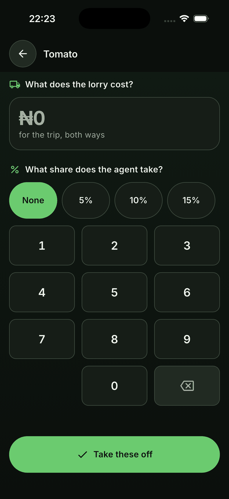
  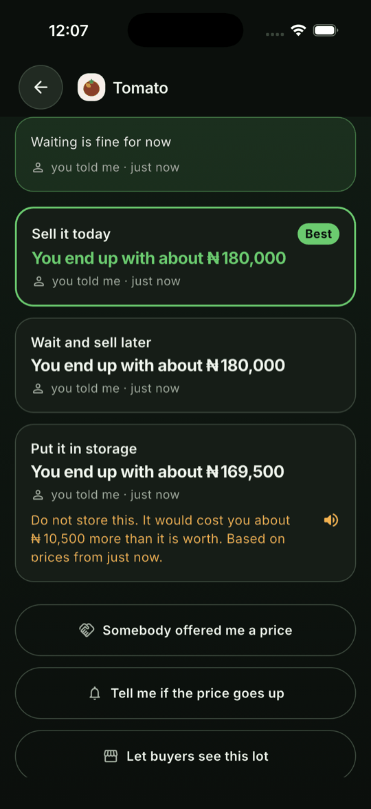
</p>

Tell it what somebody offered and it prices selling today against waiting
and against a cold room, with the transport and the agent's share taken off.
A store's quote enters as a third course, valued the same way — and on the
numbers above it loses to selling today, which is the answer a storage
company's own calculator would be least likely to give.

<p align="center">
  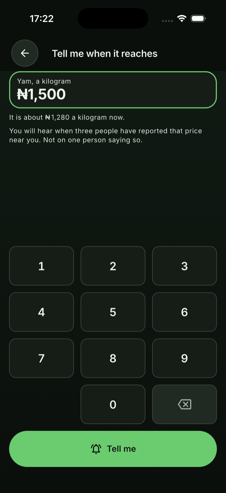
</p>

### What happened, and how often the engine was right

<p align="center">
  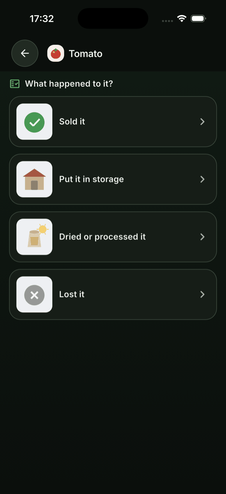
  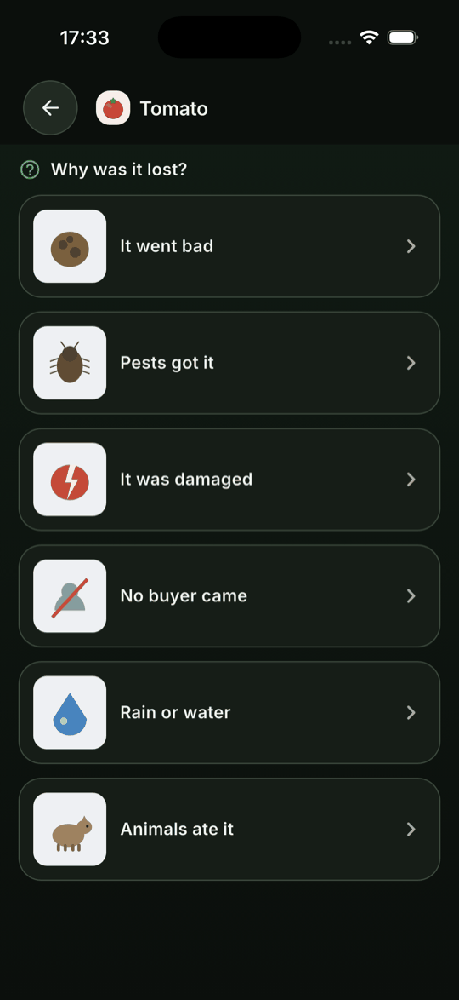
  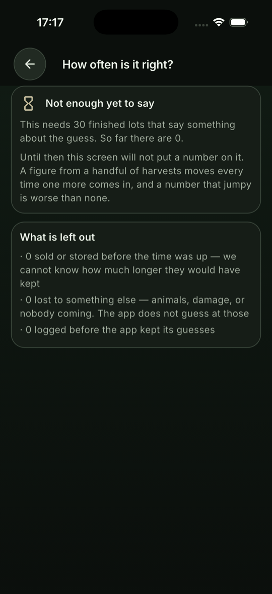
</p>

The comparison is on the home screen, under the countdowns. It refuses to
count two things: a lot **sold** before its window closed says nothing —
counting it as a success is how a model is made to look right by a product
whose whole purpose is to make people sell sooner — and a lot lost to goats
or to nobody turning up is not a shelf-life failure. Below thirty judgeable
endings it states no figure and says why.

<p align="center">
  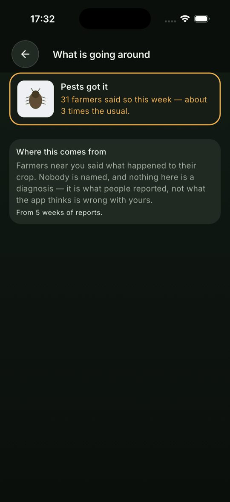
</p>

The same rows, anonymised, answer **what other farmers near you have been
losing crops to** — what people reported, by region and week, and the screen
says so in as many words. The rows carry no account id and there is no column
for one; a week under five separate reporters is absent rather than zero.

### The app is allowed to say it does not know

<p align="center">
  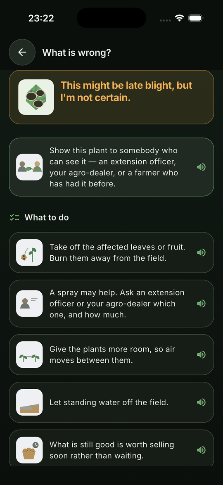
</p>

**Not reachable in the app, and deliberately so** — there is no trained
model. What is built is the part that needed none. Certainty is read from
**two numbers**: the top score, and how far it is clear of second place. A
single threshold treats 0.88 against 0.06 exactly like 0.88 against 0.84 —
the first is a model that knows, the second is a coin toss between early
blight and late blight, which call for different sprays. So the answer is one
of three sentences and never a percentage, and **both hedged answers put the
escalation above the steps**.
[ADR-0007](docs/adr/0007-two-numbers-decide-how-sure-the-app-sounds.md).

### A phone number is not a login

<p align="center">
  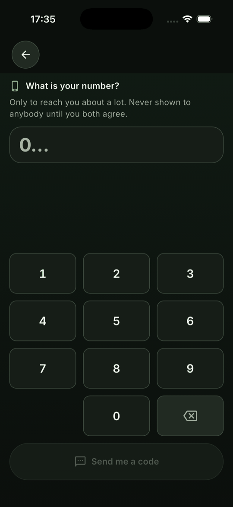
  
  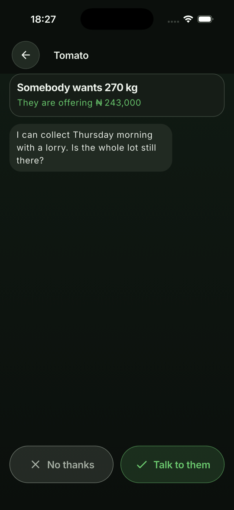
</p>

Nothing is asked for until it is needed. There is no account until a farmer
taps *Let buyers see this lot* on the decision screen — the moment *who else
could buy this* means anything — and the number is not shown to the other
party until **both** sides have accepted: the column that holds it comes back
empty from the server until then. The inbox is read from the phone's own copy,
so a farmer four days from a signal sees every enquiry that had arrived by the
time they last had one.

<p align="center">
  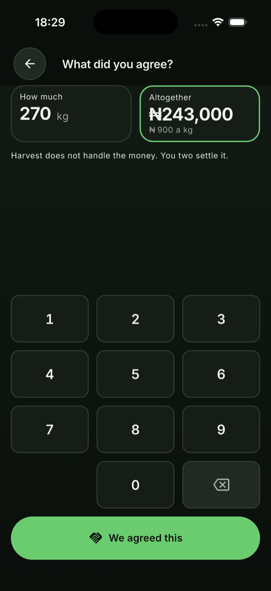
  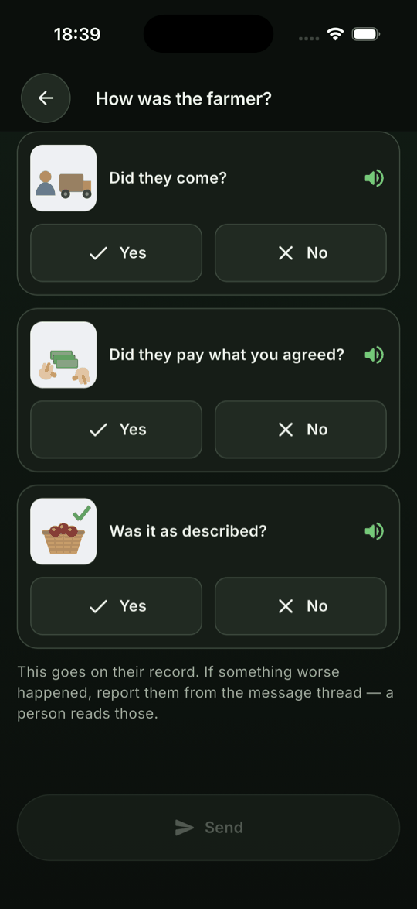
</p>

A deal becomes true when **both** confirm the same figures; only then does it
count toward the price data or either reputation. The rating is three drawn
questions and no star row — *did they come* is a fact about a morning, and it
can be drawn; the `1-5` the server stores is derived
([ADR-0012](docs/adr/0012-the-rating-is-three-questions-and-the-number-is-derived.md)).
The session survives a restart on Android, proved on a device against a live
server; the iOS half is R14.

---

## 4. What each layer does

### `app/lib/domain` — the rules, with no Flutter in them

Pure Dart, imports nothing from the platform, and `make domain-purity` fails
the build if it ever does. Crops as enums whose ids are their assets; the
spoilage engine and its versioned table; the alarms as instants that move
earlier; money as `Sourced<T>`; the decision; the spoken scales for weight
and naira; the diagnosis judges and the two-number certainty rule; the
market's matching and the basket. Held above 95% line coverage by
`make coverage-gate`.

### `app/lib/data` — SQLite, and the one migration you cannot test in production

A migration runs once per phone, on an upgrade, in a field, with nobody
watching, and is the single piece of code that can destroy a farmer's harvest
silently. So there is a test that builds a real version-1 database in raw SQL,
with a lot in it, and opens it with version-2 code; the lazy migration — drop
and recreate — fails it with precisely the sentence that would otherwise have
been a missing harvest. Migrated rows keep null predictions rather than
invented ones. The weather cache, the outbox, the inbox copy, the token store.

### `app/lib/features` — the screens, and what the domain cannot own

Language, lots, home, money, diagnosis, market, account, settings, the brand.
Local notifications scheduled at log time through the platform, and
`make device-check` asks `UserNotifications` and `AlarmManager` what they are
actually holding — that a rescheduled lot replaces its alerts rather than
doubling them, that two lots do not overwrite each other.

### `server` — only what needs two people

TypeScript on one Postgres and nothing else
([ADR-0011](docs/adr/0011-the-server-runs-on-postgres-alone.md)): the
specification asked for PostGIS, Redis and S3, and a measurement in that ADR
is why v1.0 has none of them. There is no `/spoilage`, no `/diagnose` and no
`/storage-value`, and there never will be. Price aggregation with confirmed
deals weighted highest, listings and radius search, enquiries and threads,
deals confirmed by both, verification, reputation, the job runner on
`for update skip locked`, SMS fallback, and an operator console the server
serves as a page. [`server/README.md`](server/README.md).

---

## 5. Quick start

```bash
make setup           # flutter pub get, the git hooks
make gen             # generated sources are not committed
make test            # the Dart suite: the domain, the stores, every screen
cd app && flutter run
```

The app is complete with no server: log a lot, watch the ring, get the
decision. The marketplace needs the server:

```bash
createdb harvest_dev harvest_test    # once
cd server && pnpm install
make server-run                      # from the repository root
make server-check                    # typecheck, then the suite, against harvest_test
```

### Without installing Flutter

```bash
make docker-verify   # analyze and the full test suite, on a pinned toolchain
make docker-apk      # Android only — Xcode does not run in a container
```

### Building properly

```bash
export LANG=en_US.UTF-8              # CocoaPods fails without it and never says why
cd app && flutter build ios --simulator --debug
cd app && flutter build apk --debug  # needs a JDK; CI has one, this machine's is keg-only
```

---

## 6. Correctness notes

The parts that were harder than they looked, and the bugs that reached a
green suite.

### The gate reported 570 of 570, and had stopped looking

Adding `Ailment` and `Step` meant adding them to the asset gates. There were
three places to do that, and two were done. `audio-check` then reported **570
of 570 clips present** — a green tick, a complete set, and a hundred and
fifty-five clips it did not know existed. It was not wrong about anything it
was looking at; it had stopped looking at part of the product. It was the
hundred-and-twenty-five-clip failure from three weeks earlier, happening again
inside the tooling written to catch it. Every gate now reads its lists from
one table of the Dart enums, and a gate that examines nothing fails.

### Everything built for Phase 5 was unreachable, and the app looked identical

Four sessions of marketplace work — the server, the outbox, the account
store, the sign-in screen — and running the app showed exactly what it showed
before any of it. Nothing was wired to a route. The tests were green, the
gates were green, and `screen_coverage_test` even asked the right question
— does the walk build every screen — and the answer was yes, because it
built the ones with no route. A screen covered by every suite and reachable
by nobody passes everything. The entry is *Let buyers see this lot*, on the
decision screen, where a farmer has just been told what waiting costs them.

### The pad moved between the first digit and the second

Forty baskets: tap `4`, then tap where `0` had been, and the screen said `15`.
The assumption card appears on the first digit, above the pad, and pushed
every key down by two and a half rows on the 5" floor. No error state, no way
for the farmer to know — the quietest kind of wrong a data-entry screen can
be, and not findable from the code. A number pad is a keyboard, and keyboards
do not move; the pad and Save are pinned now.

### A timestamp is the wrong cursor, and it fails quietly

`/sync/pull` answered *what has happened since I last looked* with a
timestamp watermark, and handed the client the same enquiry every time. `pg`
parses `timestamptz` to millisecond precision; Postgres stores microseconds;
so `updated_at > watermark` stayed true of the row the watermark came from,
for ever. A production client would have re-synced its whole history on every
poll and nobody would have called it a bug. Two rows in the same microsecond
and a clock that steps backwards are worse. The cursor is a sequence now.

### Three clock bugs in one small job runner

A database default made a brand-new job due in the future: `due_at default
now()` against a JavaScript `now` read a few milliseconds earlier, so the row
created by a run was not due on that run, and every job test passed with
nothing to run. Registering inside the run loop deadlocked against the test
that proves the loop skips locked rows. `due_at` comes from the caller's clock
now, and registration happens at boot.

### The matcher that would have defeated the product

A buyer assembling one order from thirty farmers: the obvious implementation
sorts by most time left — it is what a buyer would choose alone, it looks
like service, and it quietly leaves the lots most at risk to rot while doing
nothing wrong on any screen. A lot that will not last until collection is not
in the load; of the ones that will, the closest to running out go first.

### A dependency that was guarding against a bug we did not have

`flutter_timezone` had one caller and a comment saying a farmer in Lagos
scheduled in UTC would be *warned an hour early, every time, for ever*. True
of `TZDateTime(location, …)`, which reinterprets; the line used
`TZDateTime.from`, which converts. Two constructors on the same class,
adjacent in the docs, opposite in meaning. Checked rather than reasoned — one
alert read back in four zones — and removed. Then `flutter_secure_storage`
11.0.0 downloaded 152 MB of Android SDK Platform 37 mid-build, silently, and
failed anyway; 9.2.4 was chosen, and the journal says what that cost.

### Android had never compiled, and could not have

R2 sat on the ledger from Phase 0 as *no JDK on this machine*. There was one
— keg-only, invisible to `java_home`. With it found, the build failed:
`flutter_local_notifications` needs core library desugaring, and without it
the spoilage alerts — the product's whole wedge — could not be compiled for
the platform the farmer persona actually uses, after two phases of shipping
green on iOS. The failure was the point of the gate.

---

## 7. The documentation pipeline

Six documents move as the work moves, and a gate in
[`scripts/doc-check.sh`](scripts/doc-check.sh) runs in `make ci` and warns
when code has changed since the last journal entry.

| Document | Answers | Updated |
| --- | --- | --- |
| [`docs/JOURNAL.md`](docs/JOURNAL.md) | What did we do, and what surprised us? | Every session — `make journal` |
| [`CHANGELOG.md`](CHANGELOG.md) | What changed for someone using this? | Every user-visible change |
| [`docs/adr/`](docs/adr/) | Why is it built this way? | Any non-obvious decision — `make adr T="..."` |
| [`docs/ROADMAP.md`](docs/ROADMAP.md) + `PHASE` | Where are we, and what finishes this phase? | When a gate goes green |
| [`docs/RELEASE-GATES.md`](docs/RELEASE-GATES.md) | What blocks v1.0, and what would clear it? | When a gate is added or cleared |
| [`docs/FEATURE-BACKLOG.md`](docs/FEATURE-BACKLOG.md) | What is not built, and what was cut? | When features are sourced |

[`docs/RECORDING-KIT.md`](docs/RECORDING-KIT.md) is what a speaker of each
language is handed; `make recording-import` brings the clips in and
`recording-check` proves they are not the placeholders. `make counts-check`
holds the clip count and the picture count quoted here and in the ledger to
what the assets directory actually contains, anchored on the words either
side of the figure so that rewording fails loudly.

---

## 8. Data handling

Anything about the farmer's own crop stays on the phone; anything involving a
second party goes to the server, and nothing else does.

| Class | Examples | Rule |
| --- | --- | --- |
| On the phone only | Lots, windows, predictions, outcomes, the weather cache | SQLite. No server sees a lot until the farmer puts it on the market |
| Never asked for | A location, a name, an email | The app asks which of five regions you farm in, once, because a basket weighs differently in each |
| Held back until both agree | The phone number | The column comes back empty from the server until both sides accept; the promise is a row, not a rule |
| Counted only when both confirm | Deals | One party's unopposed word about a sale is a way to manufacture price data and reputation |
| Anonymised by construction | Loss reports by region and week | No account id, no column for one; a week under five reporters is absent, not zero |
| Written once, never recomputed | The prediction on a lot, with the table version | So the engine can be shown to be wrong later |
| In the platform's secure store | The refresh token | Keychain on iOS, EncryptedSharedPreferences on Android, with a reinstall guard |

---

## 9. Development

```bash
make ci              # everything CI runs: gates, analyze, tests, coverage, the server
make gates           # the blocking checks alone
make gen             # after touching a table or a provider
make assets          # regenerate the illustrations and placeholders
make speech-budget   # how long the app talks on the shortest path to a logged lot
make device-check    # ask the platform what alerts it is actually holding
make adr T="..."
make phase
```

Ten gates block `make ci` — documents, design, counts, assets, languages,
audio, pictures, splash, recordings and coverage — plus the server's own
check. **Every one was broken on purpose and watched to fire**, and two of
them went blind in the same week inside the tooling written to stop exactly
that ([§6](#6-correctness-notes)), which is why each now derives its list
from one place and fails on an empty one.

### Before a feature is called done

- The rule is in `app/lib/domain`, tested, above the coverage floor
- Every new prompt has a clip slot in every language, and `audio-check` sees it
- Every new tile is an illustration, and `picture-check` sees it
- Both themes authored; every colour pair asserted
- 200% text without truncation, on the 5" 720p floor — walked, not assumed
- Nothing states a dose or names a product
- An ADR for any non-obvious decision; `CHANGELOG.md` and the journal updated
- `make ci` green

---

## 10. Layout

```text
app/lib/domain/            crops, spoilage, lots, money, speech, diagnosis, market, net —
                           no Flutter imports, enforced by make domain-purity; Apache-2.0
app/lib/data/              SQLite, the migration and its test, the stores, the outbox
app/lib/features/          language, lots, home, money, diagnosis, market, account, settings, brand
app/lib/core/              theme, speech playback, notifications, platform
app/assets/                the 89 illustrations and the 1182 clips, generated by scripts/
app/test/                  the domain, the stores, every screen, the contrast and target walks
server/src/                routes, auth, prices, listings, messages, jobs, notify, the console
server/test/               the suite, against harvest_test
server/migrations/         one Postgres, alone
docs/adr/                  the fifteen decisions
docs/RECORDING-KIT.md      what a speaker is handed
docs/screenshots/          the twenty-two screens
scripts/                   the gates, illustrate.py, the placeholders, the recording tools
Dockerfile, compose.yaml   verify and apk without Flutter installed
```

---

## 11. Status

**Phase 4 of 7 — diagnosis, and blocked on a dataset.** Phases 0 to 3 are
cleared, less what needs a handset or data nobody has. Phase 5's marketplace
and Phase 6's calibration are built ahead, and the whole thing has been run
end to end, farmer to buyer, on a simulator against a live server.

**571 Dart tests across the domain, the stores and every screen; 201 server
tests against Postgres. The domain above 95% line coverage.**

| Phase | State |
| --- | --- |
| **0** Foundation | Cleared |
| **1** Voice and logging | Cleared, less what needs a handset — the recordings (R1), the illustrator (R4), the handset (R3) |
| **2** The spoilage engine | Cleared, less what needs a handset — whether a notification arrives three days later in a pocket with no signal |
| **3** Prices and storage | Cleared, less what needs data nobody has |
| **4** Diagnosis | **current** — everything that needs no model is built; the classifier (R10) is not, and the feature is unreachable on purpose |
| **5** Marketplace → v1.0 | Built — listings, enquiries, deals confirmed by both, ratings, SMS fallback, the console; a push gateway (R13) and iOS's token store (R14) are open |
| **6** Depth → v1.1 | Calibration and *what is going around* are built ahead; the sixth language cost what the journal says |
| **7** Reach → v1.2 | The operator console; where it stops is written down |

### What is open, and why it matters

Eleven gates in [`docs/RELEASE-GATES.md`](docs/RELEASE-GATES.md) block v1.0.
The ones that matter most:

| Open | Blocks | Why it is not closed |
| --- | --- | --- |
| Every clip a native-speaker recording | v1.0 (R1) | All 1182 are placeholders that say so; the kit is written, the speakers are not found |
| A trained classifier with published precision and recall | v1.0 (R10) | A labelled dataset nobody has; the stand-in recognises nothing, always |
| The app on a real entry-level Android, audible over a market | v1.0 (R3) | A physical handset |
| On-device speech recognition coverage for five languages | v1.0 (R7) | Measured on the reference handset, not from documentation — push-to-talk is not claimed until then |
| Every tile looked at by somebody who draws for a living | v1.0 (R4) | And who has seen the crops in an actual market |
| A push gateway a handset has registered with | v1.0 (R13) | No FCM project; `POST /devices` waits for one |

---

## 12. Licensing

Two licences, because the two halves have opposite jobs.

**The application and the server are under the
[Business Source License 1.1](LICENSE).** You may run them in production to
log, keep, price and sell harvests belonging to you, to farmers you work with,
or to buyers you serve, including as part of an agricultural service you
provide. You may not offer Harvest itself to third parties as a hosted
post-harvest or produce-marketplace service. On **2030-08-28** it converts to
Apache-2.0 automatically, and that date moves forward with each release.

**The domain package is Apache-2.0**: [`app/lib/domain`](app/lib/domain/LICENSE).

That split is the point. The window, the decision, the spoken number, the
certainty rule and the loss arithmetic come out of that directory, and a
farmer deciding on ₦180,000 — or an extension officer, a cooperative or a
buyer arguing with the figure — is entitled to read the rules that produced
it. **A number somebody is asked to sell on, produced by arithmetic nobody
outside the company may read, is a number with no standing.**

---

Read [`CHANGELOG.md`](CHANGELOG.md) for what changed and why,
[`docs/ROADMAP.md`](docs/ROADMAP.md) for the seven phases and their gates,
[`docs/RELEASE-GATES.md`](docs/RELEASE-GATES.md) for what blocks v1.0,
[`docs/FEATURE-BACKLOG.md`](docs/FEATURE-BACKLOG.md) for what was sourced and
cut, [`docs/adr/`](docs/adr/) for the fifteen decisions, and
[`docs/00-PRODUCT-STATEMENT.md`](docs/00-PRODUCT-STATEMENT.md) for the full
problem analysis.
