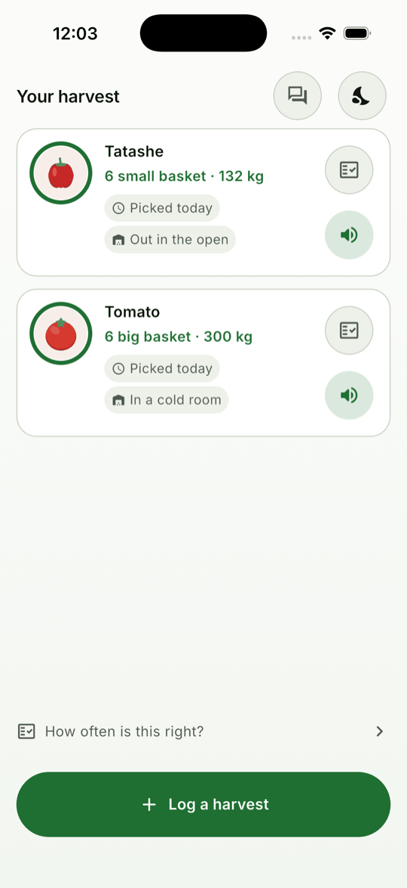

# Harvest

**Post-harvest loss prevention and offtaker matching for Nigerian smallholder farmers.**

Nigeria loses a very large share of everything it grows — commonly estimated between 30% and 50%
for perishables — in the days *after* harvest. Not to drought or pests, but to a farmer who
cannot see the market, cannot see the spoilage clock, cannot find the cold room twenty kilometres
away, and therefore sells at a bad price on day five in ignorance.

Harvest is a farmer-side decision tool that becomes a marketplace. It **logs** a harvest in thirty
seconds by voice, **warns** before the crop turns, **prices** the options against each other in
naira, and **matches** verified buyers to available lots.

See [`docs/00-PRODUCT-STATEMENT.md`](docs/00-PRODUCT-STATEMENT.md) for the full analysis.

  
  
  

> **Every crop tile and every storage tile above is hatched grey on purpose.** Those
> are placeholders that announce themselves — the illustrations are a release gate
> (R4), and a stand-in that looked like a drawing would be how a missing feature
> ships. The same is true of the audio: all 415 clips currently say, in English,
> that they are placeholders and which language belongs there.

---

## Status

**Phase 2 of 7 — the spoilage engine.** A lot is logged end to end — language,
crop, quantity in local units, where it is kept, when it was picked — stored in
SQLite, and now carries a **window**: how long it has, as a range with two ends,
from bundled versioned base values scaled by storage and weather. The harvest
list draws it as a ring that empties, and says out loud whether a lot is still
fine, half gone, nearly finished or out of time.

The pure-Dart domain is at 100% coverage and `make ci` is green.

What is not done: alerts and the decision screen (the rest of Phase 2), prices,
diagnosis and the marketplace. Push-to-talk is blocked on hardware rather than on
work — see **The hard part**.

## The insight

**The spoilage clock is the wedge, not the marketplace.**

Marketplaces need liquidity on both sides before either side gets value, which is why so many
agritech marketplaces died with empty listings. A spoilage countdown is useful to a farmer with
one crop and no buyer anywhere near the app — day one, one user, zero network effect.

And it generates exactly the data the marketplace needs: what was harvested, where, how much, and
when it must move. Liquidity accumulates as a by-product of a feature that was already worth
using alone.

## Why Flutter

On-device crop-disease inference from a single `.tflite` asset, an interface that is entirely
custom (voice-first and illustration-led, with no standard platform controls anywhere), offline
storage with real relational needs, and a hard 30 MB APK budget *including* the ML model.

## Does it need a backend?

**Yes, from v1.0** — unlike Grid. Matching is inherently multi-party: a farmer's lot must become
visible to a buyer who is a different person on a different device.

But the split holds where it matters. **Anything about the farmer's own crop runs on the phone:**
the shelf-life model, alert scheduling, disease classification, treatment guidance, unit
conversion and the storage calculator. Only cross-party work needs the server. That is what keeps
the app useful during the days-long offline periods that are normal for the primary persona.

## The hard part

System text-to-speech and speech recognition for Hausa, Yoruba, Igbo and Nigerian Pidgin are
inconsistent on Android and largely absent on iOS. Building a voice-first interface on system
speech would mean the primary persona's language works on some devices and not others.

That was checked rather than assumed: `say -v '?'` on the build machine offers **forty-three
English voices and not one** for Hausa, Yoruba, Igbo or Pidgin. So every fixed prompt is a
bundled recording, and `make audio-check` fails the build when one is missing in any of the five
languages — reading the language, phrase, crop, unit and storage lists out of the Dart enums
rather than a manifest that goes stale. See [ADR-0001](docs/adr/0001-speech-is-bundled-not-synthesised.md).

### The window has two ends, and says so

The engine returns a range, never an hour. The base value is itself a range — a
tomato out of the ground lasts two to four days depending on variety, bruising
and how ripe it was picked, and the app knows none of those three — and every
factor multiplies both ends. Temperature is the biggest lever by far: the Q10
rule, respiration roughly doubling every 10 °C, which is why a cold room is worth
paying for and is a claim the Phase 3 calculator will have to make in naira.

**A missing weather reading widens the window rather than filling it in.** FR-3.1
asks for the estimate to be marked lower-confidence; marking alone is not enough,
because nobody discounts a number because a word beside it said "estimated". So
the pessimistic end assumes a hot afternoon and the optimistic end a cool night,
and the sentence the app says gets visibly less useful — which is the honest
consequence of not knowing.

### Saying a number without stitching words together

  
  

The obvious way to say *"about forty-five kilograms"* is a clip per number word and a template
per sentence. It does not survive contact with these languages. Yoruba counts subtractively —
forty-five is *marùndínláàádọ́ta*, **five taken from fifty**, one word with nothing in it
corresponding to "forty" — and a sentence assembled from words recorded in isolation has the
wrong intonation on every one of them.

So the app says fewer numbers and says them properly: a closed scale of thirty-nine **whole
recorded sentences**, fine where lots are small and coarse where they are large, chosen by
nearest ratio. The screen shows 48 kg and the app says *"about fifty"*, which is the honest way
round given the weight is usually inferred from a table of regional averages.

### Two screens, one working condition

  
  

Dark is the default and light is one tap away, because this is not a preference —
it is a working condition. The design floor is a phone held in **direct
sunlight**, where a dark screen is the harder of the two to read; the same phone
in a store at dusk is the opposite. Both themes are authored, neither is derived
from the other, and every colour pair in both is asserted in CI at 4.5:1 for text
and 3:1 for the colours that carry state.

That test found a real defect on its first run: the light-theme amber meaning
*half the window is gone* was 2.69:1 against white.

### The farmer's correction wins, for ever

That table is versioned, and a farmer who says the app is wrong is not overruled by a later
revision of it. Their weight is stored detached from the table: four baskets, ninety-six
kilograms, marked as **corrected**, and nothing recomputes it. An app that quietly overrode
somebody who had weighed their own basket would be teaching them not to bother correcting
anything.

### Speech input is not yet claimed

Push-to-talk with a closed-vocabulary grammar over the crop catalogue is specified and not built.
Recognition coverage for these four languages cannot be verified from this machine, and this
project's rule is that a capability is checked before it is depended on. The illustrated grid is
the primary path in any case — speech is the accelerator, not the floor.

## Platforms

Android 7.0+ (primary) and iOS 14+, plus a tablet layout for the buyer and extension-officer
consoles. iOS is a first-class target, but the farmer persona is effectively Android-only — iOS
matters for the buyer, operator and extension-officer roles, which is exactly where the tablet
layouts live.
